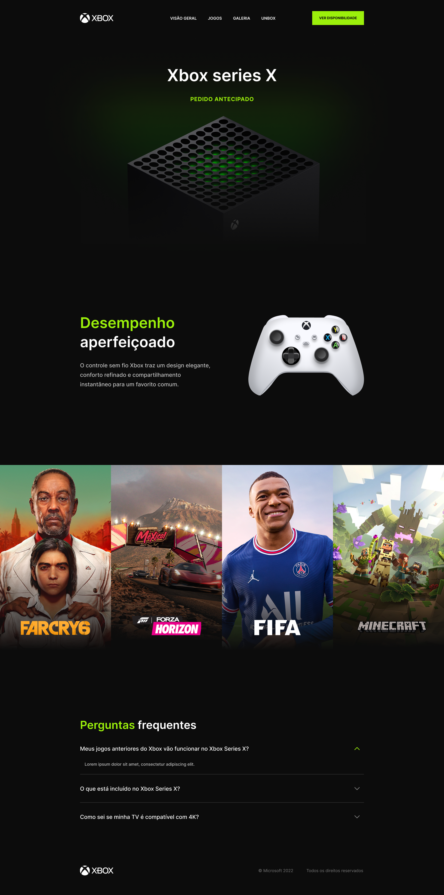

# Projeto Xbox Series X



## Deploy do Projeto

Você pode acessar o projeto "Xbox Series X" no seguinte link: [https://gleidsonfagno.github.io/Xbox-series-X/](https://gleidsonfagno.github.io/Xbox-series-X/). Este é o deploy do projeto onde você pode ver o resultado final.

Este é um projeto desenvolvido com as seguintes tecnologias:

- HTML
- CSS
- SCSS
- JavaScript

## Biblioteca do Animate On Scroll

Para adicionar animações de scroll ao projeto, utilizamos a biblioteca [Animate On Scroll (AOS)](http://michalsnik.github.io/aos/). Ela permite criar efeitos de animação de forma fácil e elegante durante a rolagem da página.

## Como Usar

1. Clone este repositório:
   ```bash
   git clone https://github.com/gleidsonfagno/Xbox-series-X.git

